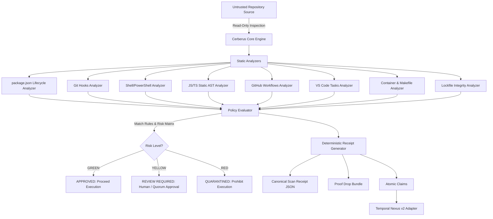

# DreamNet Cerberus Architecture & Design

## System Architecture

DreamNet Cerberus is a zero-trust, static pre-execution defense layer designed to inspect untrusted repositories before any agent, container runtime, or IDE developer environment executes scripts, installs dependencies, or builds artifacts.

## Core Architectural Principles

1. **Strict Read-Only Static Analysis**: Cerberus NEVER executes `npm install`, lifecycle scripts (`postinstall`, `prepare`), or untrusted JS/TS code during analysis.
2. **Deterministic Receipt Hashing**: Canonical JSON serialization ensures that scanning identical repository contents yields the exact same `Scan ID` and `Canonical Hash`.
3. **Multi-Vector Threat Inspection**: Inspects 9 distinct file layers to detect obfuscated commands, remote code downloads, credential theft, and unauthorized persistence mechanisms.
4. **Isolated Quarantine Vault**: Repositories classified as `RED` are automatically moved into an isolated quarantine vault (`.cerberus-quarantine`) with a signed manifest.
